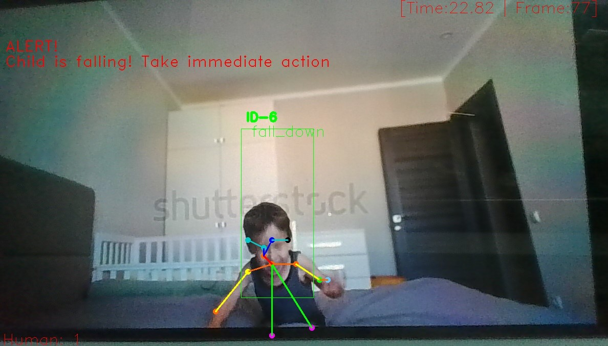

# Web-Based-Real-Time-Child-Surveillance-System

## Overview

This project presents a real time intelligent surveillance system designed to monitor human activities with a primary focus on child fall detection. By integrating computer vision techniques with deep learning based action recognition, the system continuously analyzes human movement patterns from video streams and identifies abnormal events such as falls. Upon detecting a fall, the system automatically sends a WhatsApp alert along with a captured image to a predefined contact, enabling timely response and intervention.

The project demonstrates a practical application of pose estimation, skeleton based action recognition, real time tracking and automated alerting in safety critical environments.

---

## Motivation

Ensuring child safety in home environments is a growing concern, particularly in situations where continuous supervision is not always possible. Traditional surveillance systems rely heavily on manual monitoring and lack intelligent decision making capabilities. This project aims to address these limitations by introducing an automated system that can interpret human movements, detect fall events, and immediately notify guardians without human intervention.

---

## Key Features

* Real-time video monitoring (webcam or video file)
* Skeleton-based human pose estimation
* Frame-wise action recognition
* Automatic fall detection
* WhatsApp alert with image evidence
* Live FPS and activity visualization
* Output video recording

---

## Technology Stack

* **Programming Language:** Python
* **Computer Vision:** OpenCV
* **Pose Estimation:** OpenPose-based skeleton extraction
* **Deep Learning:** TensorFlow (TF1-style compatibility on TF2)
* **Action Recognition:** CNN / LSTM-based model
* **Tracking:** Deep SORT
* **Notifications:** WhatsApp (via `pywhatkit`)

---

## Python Version Requirement

This project must be executed using Python versions lower than 3.12.

Supported versions include.

• Python 3.9

• Python 3.10

• Python 3.11

Python 3.12 is not supported due to incompatibilities with TensorFlow and other legacy dependencies used in the project.

---

## Installation Procedure

Follow the steps below to set up the project environment.

1. Clone the repository.

```bash
git clone https://github.com/your-username/child-surveillance-system.git
cd child-surveillance-system
```

2. Create a virtual environment.

```bash
python -m venv tf_env
```

3. Activate the virtual environment.

On Windows.

```bash
tf_env\Scripts\activate
```

On Linux or macOS.

```bash
source tf_env/bin/activate
```

4. Install required dependencies using the provided requirements file.

```bash
pip install -r requirements.txt
```

---

## Execution Instructions

The system can be executed in the following ways.

To run using a webcam.

```bash
python main.py
```

To run using a video file.

```bash
python main.py --video path/to/video.mp4
```

---

## WhatsApp Alert Configuration

Before running the project, update the phone number in the `main.py` file to specify the recipient of the alert messages.

```python
phone_number = "+91XXXXXXXXXX"
message = "Alert: Your child experienced a minor fall. Immediate attention required"
```

Ensure that WhatsApp Web is logged in on the system and that an active internet connection is available during execution.

---

## Demo

The following demonstration frame shows the system detecting a fall event in real time. The detected individual is highlighted with a bounding box and skeleton overlay, and the classified action is displayed as `fall_down`. Once the fall is confirmed, the system captures the frame and sends a WhatsApp alert along with the image to the configured guardian contact.




---

## Important Notes

The project uses TensorFlow 1 style APIs through TensorFlow 2 compatibility mode. Deprecation warnings from TensorFlow and NumPy may appear during execution and do not affect system functionality. The project has been tested on Windows using Python 3.9.

---

## Acknowledgement

This project was developed as a Final Year Major Project at New Horizon College of Engineering under the Artificial Intelligence and Machine Learning program. It reflects the application of deep learning and computer vision techniques for real time human activity recognition and safety oriented surveillance systems.
